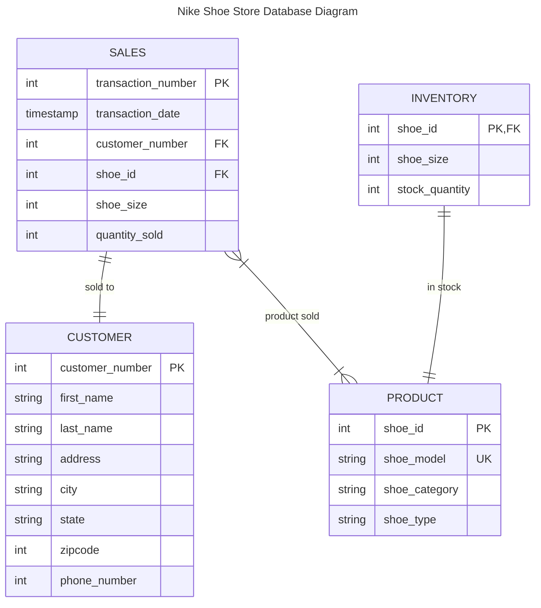

## Nike Shoe Store Database Diagram details

### PRODUCT table details
> The PRODUCT table holds records related to the **models** of shoes sold by Nike.  
> Each shoe is identified by its is unique **model name**.  
> Each unique model is identified by an integer based primary key.
> Additional shoe details stored include the **category** (Men's, Women's, Kid's, etc) and the **type** of shoe it is (Basketball, Running, etc).

### CUSTOMER table details
> The CUSTOMER table holds records related to each **customer** that makes a purchase at the store.  
> Each customer is identified by an integer based primary key.  
> Each customer is described by the following attributes:  
> * **First** and **last name**  
> * **Address**, including **city, state, and zip code**
> * **Telephone number**

### SALES table details
> The SALES table holds records relating to the **sale** of shoes to customers.  
> Each sale is identified by an integer based primary key.  
> Each sale is linked to a unique customer in the CUSTOMER table using the foreign key of **_customer_number_**.  
> Each sale is linked to one or more products sold from the PRODUCT table usiing the foreign key of **_shoe_id_**.  
> Each sale is described by the following attributes:  
> * **Date** of the transaction
> * **Size** of shoe sold
> * **Number** of shoes sold

### INVENTORY table details
> The INVENTORY table holds the records related to the **models** and **quantity** of shoes currently in inventory.  
> The inventory records are related to the PRODUCT records via the **_shoe_id_** foreign key.  
> Additional fields are the **size** of shoe in stock and the **quantity** of that size.  
